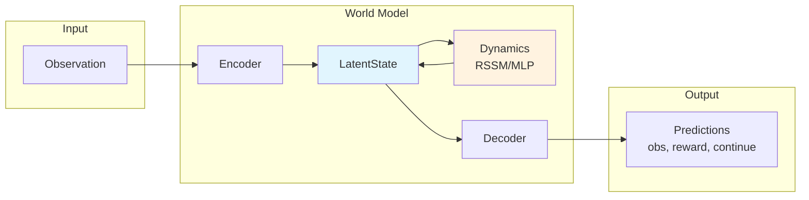

# WorldLoom

<div align="center">

**Unified Interface for Latent World Models**

*One API. Multiple Architectures. Infinite Imagination.*

[](https://opensource.org/licenses/MIT)
[](https://www.python.org/downloads/)
[](https://pytorch.org/)
[](https://github.com/astral-sh/ruff)
[](https://mypy-lang.org/)

[](https://colab.research.google.com/github/worldloom/WorldLoom/blob/main/examples/worldloom_quickstart.ipynb)

</div>

---

WorldLoom provides a unified Python interface for latent world models used in reinforcement learning. Train and deploy DreamerV3, TD-MPC2, and more through a single, consistent API.

## Features

- **Unified API**: Common interface across DreamerV3, TD-MPC2, and more
- **Simple Usage**: One-liner model creation with `create_world_model()`
- **Training Infrastructure**: Complete training loop with callbacks, checkpointing, and logging
- **Type Safe**: Full type annotations and mypy compatibility

## Architecture



**Key Concepts:**
- **Encoder**: Maps observations to latent states
- **LatentState**: Compact representation (deterministic + stochastic components)
- **Dynamics**: Predicts next latent state from current state + action
- **Decoder**: Reconstructs observations/rewards from latent states

## Model Comparison

| Feature | DreamerV3 | TD-MPC2 |
|---------|-----------|---------|
| **Input Type** | Images or State | State vectors |
| **Latent Space** | Categorical (discrete) | SimNorm (continuous) |
| **Architecture** | RSSM | Implicit MLP |
| **Decoder** | Yes | No (implicit) |
| **Best For** | Atari, visual tasks | MuJoCo, robotics |
| **Planning** | Policy rollouts | MPC with Q-ensemble |

## Installation

### From Source (recommended)

```bash
git clone https://github.com/worldloom/WorldLoom.git
cd worldloom
pip install -e "."

# With training dependencies
pip install -e ".[training]"

# With all optional dependencies
pip install -e ".[all]"

# For development
pip install -e ".[dev]"
```

### From PyPI (coming soon)

```bash
pip install worldloom
```

## Quick Start

### Create a Model

```python
from worldloom import create_world_model

# DreamerV3 (image observations)
model = create_world_model("dreamerv3:size12m")

# TD-MPC2 (state observations)
model = create_world_model("tdmpc2:5m", obs_shape=(39,), action_dim=6)
```

### Imagination Rollout

```python
import torch

# Encode initial observation
obs = torch.randn(1, 3, 64, 64)
state = model.encode(obs)

# Imagine 15 steps into the future
actions = torch.randn(15, 1, 4)  # [horizon, batch, action_dim]
trajectory = model.imagine(state, actions)

# Access predictions
print(f"Predicted rewards: {trajectory.rewards.shape}")
print(f"Continue probs: {trajectory.continues.shape}")
```

### Train a Model

```python
from worldloom import create_world_model
from worldloom.training import train, ReplayBuffer

# Create model
model = create_world_model("dreamerv3:size12m", obs_shape=(4,), action_dim=2)

# Load data
buffer = ReplayBuffer.load("trajectories.npz")

# Train (one-liner)
trained_model = train(model, buffer, total_steps=50_000)

# Save
trained_model.save_pretrained("./my_model")
```

### Full Training Control

```python
from worldloom import create_world_model
from worldloom.training import Trainer, TrainingConfig, ReplayBuffer

model = create_world_model("tdmpc2:5m", obs_shape=(39,), action_dim=6)
buffer = ReplayBuffer(capacity=100_000, obs_shape=(39,), action_dim=6)

config = TrainingConfig(
    total_steps=100_000,
    batch_size=256,
    learning_rate=1e-4,
)

trainer = Trainer(model, config)
trainer.train(buffer)
```

## Available Models

### DreamerV3

| Preset | Parameters | Description |
|--------|------------|-------------|
| `dreamerv3:size12m` | 12M | Small, fast training |
| `dreamerv3:size25m` | 25M | Balanced |
| `dreamerv3:size50m` | 50M | Standard |
| `dreamerv3:size100m` | 100M | Large |
| `dreamerv3:size200m` | 200M | Maximum capacity |

### TD-MPC2

| Preset | Parameters | Description |
|--------|------------|-------------|
| `tdmpc2:5m` | 5M | Small, fast |
| `tdmpc2:19m` | 19M | Balanced |
| `tdmpc2:48m` | 48M | Large |
| `tdmpc2:317m` | 317M | Maximum capacity |

## API Reference

### Core Methods

All world models implement the `WorldModel` protocol:

```python
# Encode observation to latent state
state = model.encode(obs)

# Predict next state (imagination, no observation)
next_state = model.predict(state, action)

# Update state with observation (posterior)
next_state = model.observe(state, action, obs)

# Decode latent state to predictions
predictions = model.decode(state)  # {"obs", "reward", "continue"}

# Multi-step imagination rollout
trajectory = model.imagine(initial_state, actions)

# Compute training losses
losses = model.compute_loss(batch)  # {"loss", "kl", "reconstruction", ...}
```

### Training API

```python
from worldloom.training import (
    Trainer,
    TrainingConfig,
    ReplayBuffer,
    train,
)

# Configuration
config = TrainingConfig(
    total_steps=100_000,
    batch_size=16,
    sequence_length=50,
    learning_rate=3e-4,
    grad_clip=100.0,
)

# Callbacks
from worldloom.training.callbacks import (
    LoggingCallback,
    CheckpointCallback,
    EarlyStoppingCallback,
    ProgressCallback,
)
```

## Examples

See the `examples/` directory:

- `worldloom_quickstart.ipynb` - Interactive Colab notebook
- `train_dreamer.py` - DreamerV3 training example
- `train_tdmpc2.py` - TD-MPC2 training example
- `visualize_imagination.py` - Imagination rollout visualization

```bash
# Quick test with random data
python examples/train_dreamer.py --test

# Train with real data
python examples/train_dreamer.py --data trajectories.npz --steps 100000

# Collect Atari data
python examples/collect_atari.py --env Breakout --episodes 100

# Train on Atari
python examples/train_atari_dreamer.py --data atari_data.npz --steps 100000
```

## Benchmarks

Results on standard benchmarks (coming soon):

| Environment | Model | Score | Training Steps |
|-------------|-------|-------|----------------|
| Atari Breakout | DreamerV3-50M | - | 200K |
| MuJoCo HalfCheetah | TD-MPC2-19M | - | 1M |
| DMControl Walker | DreamerV3-25M | - | 500K |

## Documentation

- [Full Documentation](https://worldloom.readthedocs.io) - Comprehensive guides and API reference
- [Tutorials](https://worldloom.readthedocs.io/tutorials/) - Step-by-step learning
- [API Reference](https://worldloom.readthedocs.io/api/) - Detailed API docs

## Security

See [SECURITY.md](SECURITY.md) for security considerations, especially regarding loading model checkpoints from untrusted sources.

## License

MIT License - see [LICENSE](LICENSE) for details.

## Contributing

Contributions are welcome! Please read our [Contributing Guide](CONTRIBUTING.md) before submitting pull requests.

## Citation

If you use this library in your research, please cite:

```bibtex
@software{worldloom,
  title = {WorldLoom: Unified Interface for Latent World Models},
  year = {2026},
  url = {https://github.com/worldloom/WorldLoom}
}
```

## Acknowledgments

WorldLoom builds on the excellent research from:
- [DreamerV3](https://arxiv.org/abs/2301.04104) - Hafner et al.
- [TD-MPC2](https://arxiv.org/abs/2310.16828) - Hansen et al.
