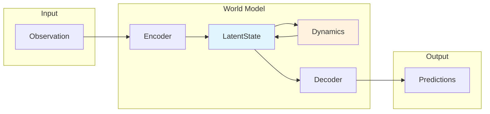

# Core Concepts

Understanding WorldLoom's architecture and key components.

## What is a World Model?

A **world model** is a neural network that learns to predict how an environment evolves. It enables:

- **Planning**: Predict outcomes without real environment interaction
- **Imagination**: Generate synthetic experience for training
- **Efficient Learning**: Learn from fewer real interactions

## Architecture Overview



## Key Components

### Encoder

Compresses high-dimensional observations into compact latent representations.

```python
state = model.encode(obs)  # [B, *obs_shape] -> LatentState
```

### LatentState

The core representation that captures environment state:

```python
state.deterministic  # History/context information
state.stochastic     # Uncertainty (DreamerV3 only)
state.features       # Combined representation for downstream use
```

### Dynamics Model

Predicts next latent state given current state and action:

```python
# Prior (imagination, no observation)
next_state = model.predict(state, action)

# Posterior (with observation)
next_state = model.observe(state, action, obs)
```

### Decoder

Reconstructs observations and predicts rewards from latent states:

```python
predictions = model.decode(state)
# {"obs": reconstructed_obs, "reward": reward, "continue": continue_prob}
```

## Imagination Rollouts

The key feature: multi-step prediction without environment:

```python
trajectory = model.imagine(initial_state, actions)
# trajectory.states    - List of predicted LatentStates
# trajectory.rewards   - [T, B, 1] predicted rewards
# trajectory.continues - [T, B, 1] episode continuation probs
```

## Model Types

### DreamerV3

- **Input**: Images or state vectors
- **Architecture**: RSSM (Recurrent State Space Model)
- **Latent Space**: Categorical (discrete)
- **Decoder**: Reconstructs observations
- **Best For**: Visual tasks (Atari)

### TD-MPC2

- **Input**: State vectors
- **Architecture**: Implicit MLP
- **Latent Space**: SimNorm (continuous)
- **Decoder**: None (implicit model)
- **Best For**: Continuous control (MuJoCo)

## Training Loop

World models learn from trajectories collected from the environment:

```
1. Collect trajectories (obs, actions, rewards, dones)
2. Store in ReplayBuffer
3. Sample batches
4. Compute loss (reconstruction + KL + reward prediction)
5. Update model
6. Repeat
```

## Next Steps

- [Train Your First Model](../tutorials/train-first-model.md)
- [DreamerV3 vs TD-MPC2](../tutorials/dreamer-vs-tdmpc2.md)
